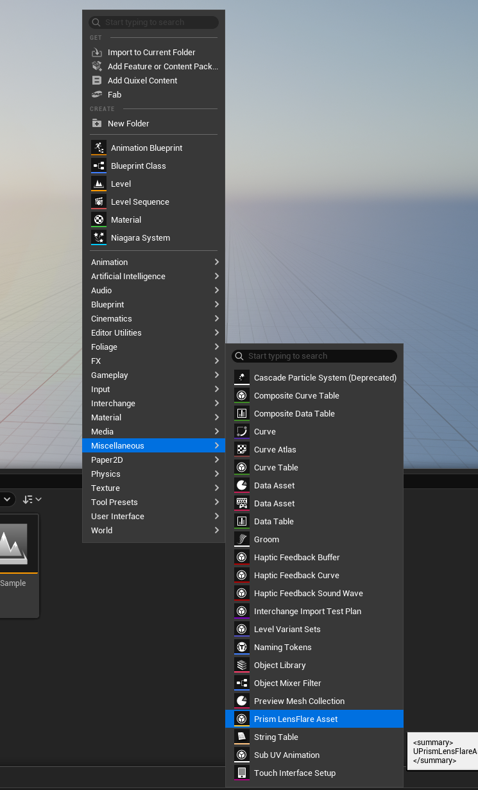
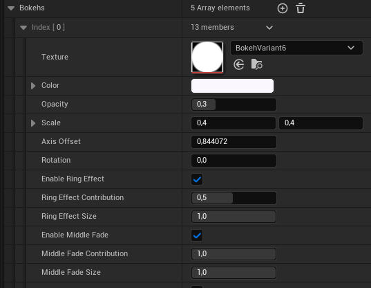
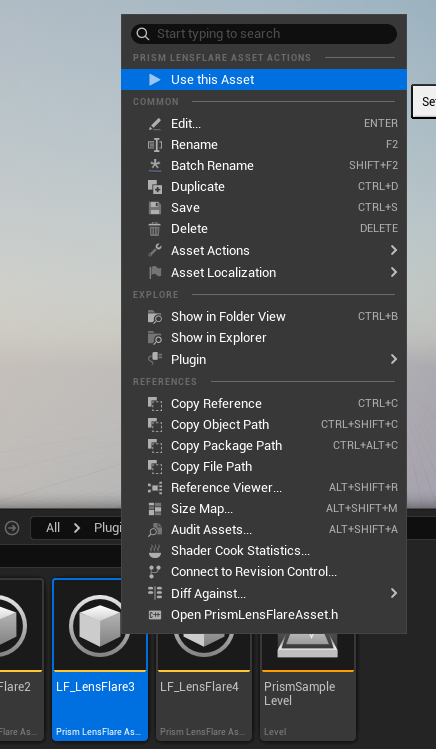
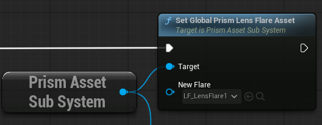

# Prism LensFlare asset creation.
Right click the content browser and go under Miscellaneous/Prism LensFlare asset.

# Prism LensFlare settings.
* Bokehs: Bokehs is an array of bokeh elements.
* Texture: Texture specifies the texture the lens-flare bokeh will have.
* Color: Specifies the Tint/Color the lensflare bokeh will have.
* Opacity: The transparency of the lensflare bokeh.
* Scale: The size of the lensflare bEnableokeh.
* AxisOffset: The offset the lensflare bokeh will have in regards to the sun. 1.0 means it will be on the sun, any other value will move the bokeh around on the sun axis.
* Rotation: The rotation of the lensflare bokeh.

**Ring Effect**
Ring Effect is a vignette effect that surrounds the sun's position. This will make the bokeh fade out of it is far away from the sun location.
* EnableRingEffect: Enables the vignette ring effect.
* RingEffectContribution: The amount of opacity difference the ring effect will apply.

**Middle Fade**
Middle Fade means how much the lensflare bokeh will disappear when it is in line with the sun (e.g. the camera is pointing directly at the sun)
* EnableMiddleStrength: Enables the middle fade effect.
* MiddleFadeSize: The size of the vignette border around the sun.

* AlwaysFaceLight: Will always point the bokeh to the sun position. (Rotation can still be applied but it will be an offset)

# Settings a prism asset.
### In the editor.
Right click on your created PrismLensflareAsset and click "Use this Asset".

### Via Blueprints
Find the SetGlobalPrismLensflareAsset node in your blueprint along with the PrismAssetSubSystem SubSystem node.

Youc an use the GetGlobalPrismLensFlareAsset node to get the currently acrtive PrismLensFlare.

